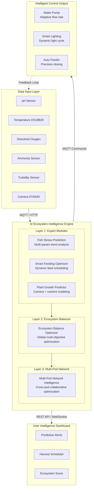
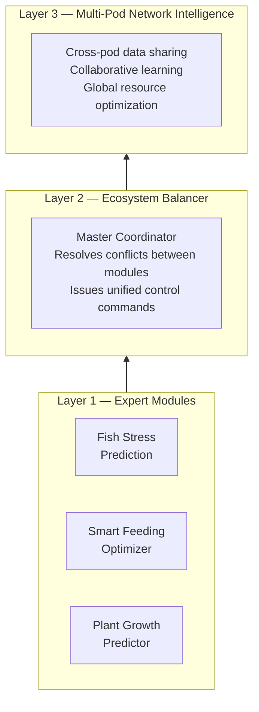
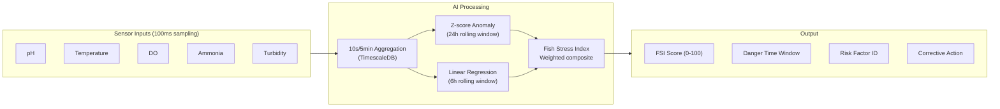
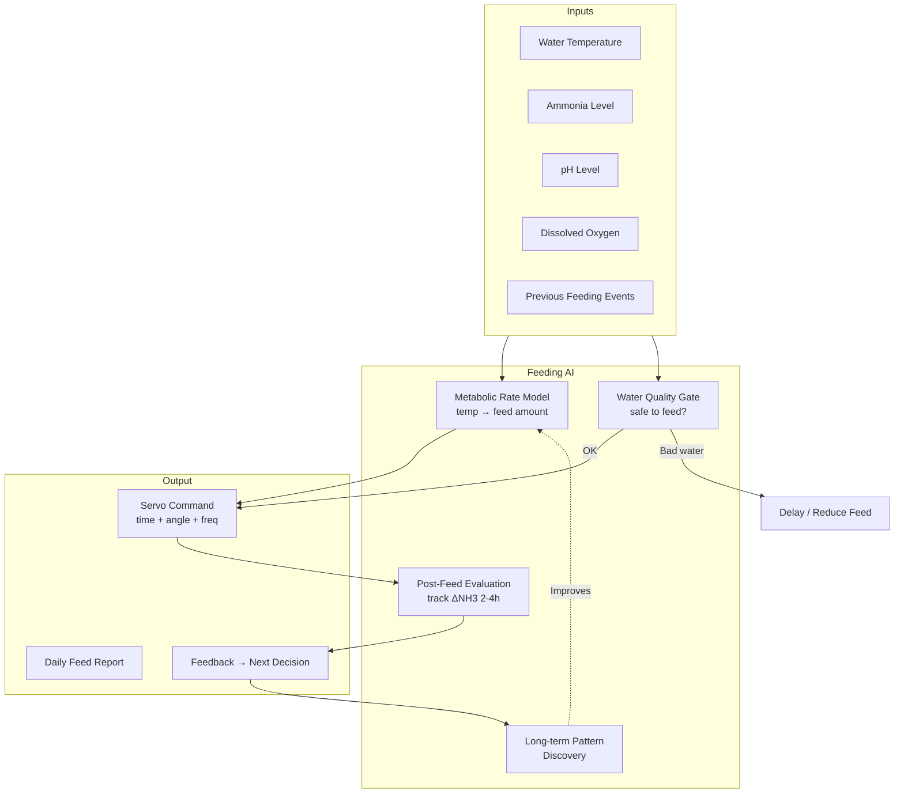
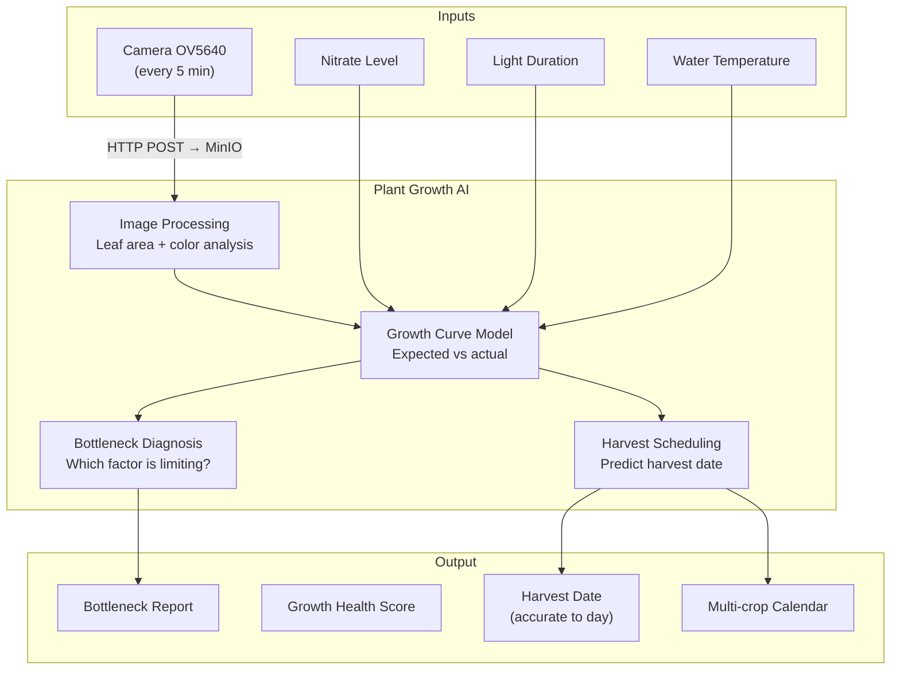
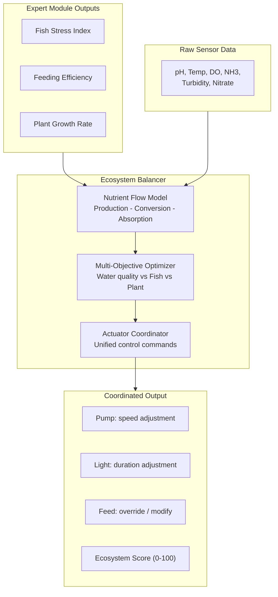

# AI Ecosystem Intelligence - Technical Specification

> This document extends Section 4 of the [Technical Roadmap](./TECHNICAL_ROADMAP.md), providing the complete technical specification for the AI/Big Data intelligence layer of the EcoSphere Pod system.

## 1. AI System Architecture Overview

### 1.1 Four-Layer Data Flow



### 1.2 AI Technology Stack

| Layer | Component | Technology |
| --- | --- | --- |
| **Data Ingestion** | Sensor telemetry | MQTT (Mosquitto) via ESP32 WiFi |
| | Camera images | HTTP POST to MinIO (S3-compatible) |
| **Storage** | Time-series data | PostgreSQL + TimescaleDB (Hypertable) |
| | Real-time state cache | Redis |
| | Plant images | MinIO object storage |
| **Analytics (MVP)** | Rule engine + statistics | Python (Pandas, Statsmodels, Scikit-learn) |
| **Analytics (Post-Launch)** | ML models | XGBoost, LSTM (PyTorch), TensorFlow Lite |
| **Computer Vision** | Plant image analysis | CNN (MobileNetV2 / ResNet-18) |
| **Edge Inference** | On-device decisions | TensorFlow Lite on ESP32 / rule fallback |
| **API** | AI endpoints | REST: `/api/pods/{id}/eco-score`, `/recommendations`, `/prediction` |
| **Scheduling** | Batch analytics | Python CRON jobs on monolith server |

### 1.3 Three-Layer AI Architecture



**Without this architecture:** 4 independent features that may conflict with each other.
**With this architecture:** 1 unified system where every decision is globally optimized.

**Network effect:** Every new Pod benefits from the collective intelligence of all existing Pods.

## 2. Two-Phase AI Strategy

### 2.1 Phase 1: MVP — Expert System + Statistical Models

Due to the cold-start problem (no real-world labeled data at launch), the MVP intelligence relies on:

```yaml
MVP_Intelligence:
  Anomaly_Detection:
    algorithm: Z-score on 24-hour rolling window
    threshold: 3 sigma deviation triggers alert
    implementation: Python Pandas CRON job (hourly)
    
  Trend_Analysis:
    algorithm: Linear regression on 6-hour rolling windows
    output: Direction (rising/falling) + velocity (units/hour)
    implementation: Python Statsmodels
    
  Composite_Scoring:
    formula: "FSI = w1*pH_dev + w2*temp_dev + w3*DO_dev + w4*NH3_dev + w5*turb_dev"
    weights: Derived from published health scoring thresholds
    output: Fish Stress Index (0-100)
    
  Rule_Engine:
    - "IF ammonia > 1.0 ppm THEN alert + reduce feeding"
    - "IF temp < target_min THEN heater ON"
    - "IF DO < target_min THEN pump HIGH"
    - "IF net_nutrient > threshold THEN reduce feeding 20% + extend lighting 2h"
    
  Scheduling:
    runner: Python CRON on monolith server
    frequency: Hourly aggregation + real-time rule checks
    data_source: TimescaleDB continuous aggregates
```

### 2.2 Phase 2: Post-Launch — Machine Learning Models

After 3-6 months of real-world data collection across hundreds of active Pods:

```yaml
ML_Models:
  Fish_Stress:
    model: LSTM multivariate time-series forecasting
    training_data: Mendeley tilapia dataset (6 months)
    explainability: XGBoost + SHAP (following AquaML methodology)
    prediction_horizon: 2-6 hours forward
    
  Feeding_Optimization:
    model: Contextual Bandit (reinforcement learning)
    reward_signal: Inverse of post-feeding ammonia spike
    features: [water_temp, pre_feed_nh3, time_since_last_feed, DO_level]
    
  Plant_Growth:
    model: MobileNetV2 CNN (fine-tuned)
    pre_training_data: Hydroponic Farming Dataset (390K lettuce images)
    multi_modal: CNN image features + sensor nutrient regression
    output: Growth rate, health score, harvest date prediction
    
  Ecosystem_Balance:
    model: Multi-objective optimization (Pareto frontier)
    objectives: [minimize_water_toxicity, maximize_fish_growth, maximize_plant_growth]
    control_variables: [feeding_rate, lighting_duration, pump_cycle]
    constraint: Algae bloom risk < safety threshold
    
  Edge_Deployment:
    framework: TensorFlow Lite
    target: ESP32 (lightweight inference)
    latency_target: < 200ms
    fallback: Rule-based safety checks always active on-device
```

## 3. Feature Specifications

### 3.1 Fish Stress Prediction

#### Data Pipeline



#### Algorithm Detail

```python
# MVP: Fish Stress Index Calculation
def calculate_fsi(pod_id, window_hours=24):
    """
    Compute Fish Stress Index using Z-score deviation
    from dynamic baseline (species-specific).
    """
    # Fetch rolling stats from TimescaleDB continuous aggregates
    stats = query_sensor_hourly_aggs(pod_id, hours=window_hours)
    
    # Z-score for each parameter
    ph_z = abs(current.ph - stats.ph_mean) / stats.ph_std
    temp_z = abs(current.temp - stats.temp_mean) / stats.temp_std
    do_z = abs(current.do - stats.do_mean) / stats.do_std
    nh3_z = abs(current.nh3 - stats.nh3_mean) / stats.nh3_std
    turb_z = abs(current.turb - stats.turb_mean) / stats.turb_std
    
    # Weighted composite (weights from health scoring literature)
    weights = get_species_weights(pod_id)  # from pod_config table
    fsi = (weights.ph * ph_z + 
           weights.temp * temp_z + 
           weights.do * do_z + 
           weights.nh3 * nh3_z + 
           weights.turb * turb_z)
    
    # Normalize to 0-100 scale
    fsi_normalized = min(100, fsi * 20)
    
    # Trend projection: hours until danger zone
    danger_hours = project_danger_window(pod_id, stats)
    
    return {
        "fsi_score": fsi_normalized,
        "predicted_danger_hours": danger_hours,
        "dominant_risk_factor": get_max_contributor(weights, z_scores),
        "recommended_action": generate_action(fsi_normalized, dominant_factor)
    }
```

#### Database Schema

```sql
-- Fish Stress Index Results
CREATE TABLE fish_stress_scores (
    time                  TIMESTAMPTZ       NOT NULL,
    pod_id                VARCHAR(50)       NOT NULL,
    fsi_score             DOUBLE PRECISION  NOT NULL,  -- 0-100
    dominant_risk_factor  VARCHAR(20),                  -- 'ph', 'temp', 'do', 'nh3', 'turbidity'
    predicted_danger_hours DOUBLE PRECISION,            -- hours until danger zone
    recommended_action    TEXT,
    model_version         VARCHAR(10)       DEFAULT 'mvp_v1'
);

SELECT create_hypertable('fish_stress_scores', 'time');
```

#### API Endpoints

```yaml
GET /api/pods/{pod_id}/eco-score:
  response:
    fsi_score: 73
    risk_level: "moderate"
    dominant_factor: "ammonia"
    detail: "Ammonia rising at 0.15 ppm/hour"

GET /api/pods/{pod_id}/prediction?metric=fish_stress&hours=6:
  response:
    predictions:
      - { hour: 1, projected_fsi: 75 }
      - { hour: 2, projected_fsi: 79 }
      - { hour: 3, projected_fsi: 84 }
      - { hour: 6, projected_fsi: 92 }
    warning: "FSI projected to exceed 85 (high risk) within 3 hours"
    suggested_action: "Increase pump speed to boost dissolved oxygen"
```

### 3.2 Smart Feeding Optimizer

#### Data Pipeline



#### Algorithm Detail

```python
# MVP: Temperature-based Metabolic Scaling
def calculate_feed_amount(pod_id):
    """
    Dynamic feeding calculation based on Q10 temperature coefficient.
    Fish metabolism drops ~50% per 10°C decrease.
    """
    config = get_pod_config(pod_id)
    current_temp = get_latest_sensor(pod_id, 'temperature')
    
    # Q10 metabolic scaling
    Q10 = 2.0  # standard biological temperature coefficient
    reference_temp = config.target_temp_optimal  # e.g., 25°C
    base_amount = config.base_feed_grams         # e.g., 20g
    
    scaling_factor = Q10 ** ((current_temp - reference_temp) / 10.0)
    adjusted_amount = base_amount * scaling_factor
    
    # Water quality gate
    current_nh3 = get_latest_sensor(pod_id, 'ammonia')
    current_do = get_latest_sensor(pod_id, 'dissolved_oxygen')
    
    if current_nh3 > config.target_nh3_max:
        return {"action": "delay", "reason": "ammonia_elevated", "retry_after_minutes": 60}
    if current_do < config.target_do_min:
        adjusted_amount *= 0.5  # reduce by 50% in low oxygen
    
    # Convert to servo command
    servo_angle = amount_to_servo_angle(adjusted_amount)
    
    return {
        "action": "feed",
        "amount_grams": round(adjusted_amount, 1),
        "servo_angle": servo_angle,
        "water_temp": current_temp,
        "scaling_factor": round(scaling_factor, 2)
    }


# Post-Feeding Evaluation (runs 2-4 hours after each feed)
def evaluate_feeding_result(pod_id, feed_event_id):
    """
    Measure ammonia response curve after feeding.
    High spike = overfeeding. Minimal change = efficient.
    """
    feed_event = get_feed_event(feed_event_id)
    
    # Get NH3 readings for 4 hours post-feed
    nh3_curve = query_sensor_data(
        pod_id, 'ammonia',
        start=feed_event.time,
        end=feed_event.time + timedelta(hours=4)
    )
    
    pre_feed_nh3 = feed_event.pre_feed_nh3
    peak_nh3 = max(nh3_curve.values)
    delta_nh3 = peak_nh3 - pre_feed_nh3
    recovery_hours = calculate_recovery_time(nh3_curve, pre_feed_nh3)
    
    # Classify feeding efficiency
    if delta_nh3 > 0.5:
        efficiency = "overfed"
        adjustment = -0.15  # reduce next feed by 15%
    elif delta_nh3 < 0.1:
        efficiency = "underfed"
        adjustment = +0.10  # increase next feed by 10%
    else:
        efficiency = "optimal"
        adjustment = 0
    
    # Store result for learning
    return {
        "feed_efficiency": efficiency,
        "delta_nh3": delta_nh3,
        "recovery_hours": recovery_hours,
        "next_feed_adjustment": adjustment
    }
```

#### Database Schema

```sql
-- Feeding Events with Outcome Tracking
CREATE TABLE feeding_events (
    time                      TIMESTAMPTZ       NOT NULL,
    pod_id                    VARCHAR(50)       NOT NULL,
    amount_grams              DOUBLE PRECISION  NOT NULL,
    servo_angle               INTEGER,
    water_temp_at_feed        DOUBLE PRECISION,
    scaling_factor            DOUBLE PRECISION,
    pre_feed_nh3              DOUBLE PRECISION,
    post_feed_nh3_peak        DOUBLE PRECISION,
    delta_nh3                 DOUBLE PRECISION,
    recovery_hours            DOUBLE PRECISION,
    feed_efficiency           VARCHAR(10),       -- 'overfed', 'optimal', 'underfed'
    next_feed_adjustment      DOUBLE PRECISION,  -- multiplier for next feed
    model_version             VARCHAR(10)       DEFAULT 'mvp_v1'
);

SELECT create_hypertable('feeding_events', 'time');
```

#### MQTT Actuator Command

```json
{
  "topic": "pod/{device_id}/actuator/feeder/cmd",
  "payload": {
    "command_id": "cmd_feed_20260415_1030",
    "action": "feed",
    "amount_grams": 15.2,
    "servo_angle": 45,
    "timestamp": "2026-04-15T10:30:00Z"
  }
}
```

### 3.3 Plant Growth Predictor

#### Data Pipeline



#### Algorithm Detail

```python
# MVP: Simple Image Differencing for Growth Rate
def analyze_plant_growth(pod_id, date):
    """
    Compare consecutive daily photos to measure growth.
    Uses green channel histogram for health assessment.
    """
    today_img = fetch_image_from_minio(pod_id, date)
    yesterday_img = fetch_image_from_minio(pod_id, date - timedelta(days=1))
    
    # Leaf area measurement (pixel count of green regions)
    today_leaf_area = segment_green_pixels(today_img)
    yesterday_leaf_area = segment_green_pixels(yesterday_img)
    daily_growth_rate = (today_leaf_area - yesterday_leaf_area) / yesterday_leaf_area
    
    # Green channel histogram for health detection
    green_ratio = calculate_green_ratio(today_img)
    # green_ratio < 0.4 indicates yellowing (nutrient deficiency)
    
    # Height estimation (topmost green pixel relative to grow bed baseline)
    height_px = estimate_height(today_img)
    
    # Growth curve comparison
    config = get_pod_config(pod_id)
    expected_rate = get_expected_growth_rate(
        species=config.plant_species,
        days_since_planting=config.days_planted
    )
    health_score = min(100, (daily_growth_rate / expected_rate) * 100)
    
    # Bottleneck diagnosis
    bottleneck = diagnose_bottleneck(pod_id, health_score, green_ratio)
    
    # Harvest date projection
    current_size = today_leaf_area
    target_size = get_harvest_target(config.plant_species)
    if daily_growth_rate > 0:
        days_to_harvest = (target_size - current_size) / (current_size * daily_growth_rate)
        predicted_harvest = date + timedelta(days=days_to_harvest)
    else:
        predicted_harvest = None  # growth stalled
    
    return {
        "leaf_area_px": today_leaf_area,
        "daily_growth_rate_pct": round(daily_growth_rate * 100, 2),
        "green_ratio": round(green_ratio, 3),
        "height_estimate_px": height_px,
        "growth_health_score": round(health_score, 1),
        "bottleneck_factor": bottleneck,
        "predicted_harvest_date": predicted_harvest
    }


def diagnose_bottleneck(pod_id, health_score, green_ratio):
    """
    Cross-reference sensor data with growth data
    to identify the specific limiting factor.
    """
    if health_score >= 80:
        return None  # growing well
    
    sensors = get_latest_sensors(pod_id)
    config = get_pod_config(pod_id)
    
    # Check nutrient levels
    if sensors.nitrate < config.target_nitrate_min:
        return {
            "factor": "low_nutrients",
            "detail": f"Nitrate at {sensors.nitrate} ppm, target minimum is {config.target_nitrate_min}",
            "action": "Consider increasing fish feeding to boost nutrient production"
        }
    
    # Check light duration
    light_hours = get_daily_light_hours(pod_id)
    required_hours = get_required_light(config.plant_species, config.growth_stage)
    if light_hours < required_hours:
        return {
            "factor": "insufficient_light",
            "detail": f"Current {light_hours}h/day, recommended {required_hours}h/day",
            "action": f"Extend smart lighting by {required_hours - light_hours} hours"
        }
    
    # Check temperature
    if sensors.temp < config.target_temp_min or sensors.temp > config.target_temp_max:
        return {
            "factor": "temperature_stress",
            "detail": f"Water temp {sensors.temp}°C outside optimal range",
            "action": "Adjust heater settings"
        }
    
    return {"factor": "unknown", "action": "Monitor for additional data"}
```

#### Database Schema

```sql
-- Plant Growth Records (daily measurements)
CREATE TABLE plant_growth_records (
    time                  TIMESTAMPTZ       NOT NULL,
    pod_id                VARCHAR(50)       NOT NULL,
    plant_species         VARCHAR(50),
    image_url             TEXT,              -- MinIO object path
    leaf_area_px          INTEGER,
    green_ratio           DOUBLE PRECISION,
    height_estimate_px    INTEGER,
    daily_growth_rate_pct DOUBLE PRECISION,
    growth_health_score   DOUBLE PRECISION,  -- 0-100
    bottleneck_factor     VARCHAR(30),       -- 'low_nutrients', 'insufficient_light', etc.
    predicted_harvest_date DATE,
    model_version         VARCHAR(10)       DEFAULT 'mvp_v1'
);

SELECT create_hypertable('plant_growth_records', 'time');
```

### 3.4 Ecosystem Balance Optimizer

#### Data Pipeline



#### Algorithm Detail

```python
# MVP: Material Balance Equation
def calculate_ecosystem_balance(pod_id):
    """
    Model the nutrient cycle as a material flow:
    fish_waste_production - biofilter_conversion - plant_absorption = net_accumulation
    """
    config = get_pod_config(pod_id)
    sensors = get_latest_sensors(pod_id)
    
    # Estimate daily nutrient flows (mg/day)
    # Fish waste production: based on feeding amount and fish biomass
    daily_feed = get_daily_feed_total(pod_id)
    fish_waste_nh3 = daily_feed * 0.03  # ~3% of feed becomes ammonia
    
    # Biofilter conversion: temperature-dependent
    # Nitrifying bacteria efficiency drops below 20°C
    biofilter_efficiency = min(1.0, sensors.temp / 25.0)
    converted_to_nitrate = fish_waste_nh3 * biofilter_efficiency * 0.85
    
    # Plant absorption: based on growth rate and light hours
    plant_growth = get_latest_plant_growth(pod_id)
    light_hours = get_daily_light_hours(pod_id)
    plant_absorption = plant_growth.daily_growth_rate_pct * config.plant_biomass_estimate * 0.02
    
    # Net nutrient accumulation
    net_accumulation = fish_waste_nh3 - converted_to_nitrate - plant_absorption
    
    # Generate coordinated control strategy
    if net_accumulation > 0.5:  # nutrient buildup (dangerous)
        strategy = {
            "feeding": {"action": "reduce", "amount": "-20%"},
            "lighting": {"action": "extend", "hours": "+2h"},
            "pump": {"action": "increase_speed", "level": "HIGH"},
            "reason": "Nutrient accumulation detected — reducing input, boosting absorption"
        }
    elif net_accumulation < -0.3:  # nutrient deficit
        strategy = {
            "feeding": {"action": "increase", "amount": "+15%"},
            "lighting": {"action": "maintain"},
            "pump": {"action": "maintain"},
            "reason": "Nutrient deficit — plants consuming faster than fish producing"
        }
    else:  # balanced
        strategy = {
            "feeding": {"action": "maintain"},
            "lighting": {"action": "maintain"},
            "pump": {"action": "maintain"},
            "reason": "Ecosystem in balance"
        }
    
    # Calculate sub-scores
    fsi = get_latest_fsi(pod_id)
    water_score = max(0, 100 - (sensors.nh3 / config.target_nh3_max * 50))
    fish_score = max(0, 100 - fsi.fsi_score)
    plant_score = plant_growth.growth_health_score
    overall_score = (water_score * 0.35 + fish_score * 0.35 + plant_score * 0.30)
    
    return {
        "overall_score": round(overall_score, 1),
        "water_quality_sub": round(water_score, 1),
        "fish_health_sub": round(fish_score, 1),
        "plant_health_sub": round(plant_score, 1),
        "net_nutrient_flow": round(net_accumulation, 3),
        "strategy": strategy
    }
```

#### Multi-Pod Coordination

```yaml
# Extends ecosystem_rules_table from TECHNICAL_ROADMAP.md Section 5.3
Multi_Pod_AI_Rules:
  
  nutrient_rebalancing:
    condition: "Pod_A.net_nutrient > 0.5 AND Pod_B.net_nutrient < -0.3"
    actions:
      - Pod_A: "Reduce feeding 15%"
      - Pod_B: "Increase feeding 10%"
      - Shared_pump: "Redirect 30% water flow from A to B"
    priority: HIGH

  collaborative_learning:
    trigger: "New Pod joins network"
    actions:
      - "Query all Pods with same fish_species and plant_species"
      - "Transfer baseline parameters (weights, thresholds) to new Pod"
      - "Reduce calibration period from 3 weeks to 1 week"

  network_health_report:
    frequency: "Daily"
    output:
      - "Average ecosystem score across all Pods"
      - "Worst-performing Pod identification"
      - "Network-wide nutrient efficiency trend"
```

#### Database Schema

```sql
-- Ecosystem Balance Scores
CREATE TABLE ecosystem_scores (
    time                  TIMESTAMPTZ       NOT NULL,
    pod_id                VARCHAR(50)       NOT NULL,
    overall_score         DOUBLE PRECISION  NOT NULL,  -- 0-100
    water_quality_sub     DOUBLE PRECISION,
    fish_health_sub       DOUBLE PRECISION,
    plant_health_sub      DOUBLE PRECISION,
    net_nutrient_flow     DOUBLE PRECISION,
    dominant_imbalance    VARCHAR(30),
    recommended_actions   JSONB,
    model_version         VARCHAR(10)       DEFAULT 'mvp_v1'
);

SELECT create_hypertable('ecosystem_scores', 'time');

-- Multi-Pod Ecosystem Binding (extends TECHNICAL_ROADMAP Section 5.3)
CREATE TABLE ecosystem_ai_state (
    time                  TIMESTAMPTZ       NOT NULL,
    ecosystem_id          VARCHAR(50)       NOT NULL,
    pod_scores            JSONB,            -- {"P001": 82, "P002": 75, "P003": 88}
    network_avg_score     DOUBLE PRECISION,
    rebalancing_actions   JSONB,
    learning_transfers    INTEGER DEFAULT 0  -- count of parameter transfers
);

SELECT create_hypertable('ecosystem_ai_state', 'time');
```

#### API Endpoints

```yaml
GET /api/pods/{pod_id}/eco-score:
  response:
    overall_score: 82
    water_quality_sub: 78
    fish_health_sub: 85
    plant_health_sub: 83
    net_nutrient_flow: +0.12
    status: "balanced"

GET /api/pods/{pod_id}/recommendations:
  response:
    - type: "feeding"
      action: "maintain"
      reason: "Current feeding efficiency is optimal"
    - type: "lighting"
      action: "extend_1h"
      reason: "Plant growth 15% below expected — boosting light exposure"

GET /api/pods/{pod_id}/prediction?metric=ecosystem_balance&days=7:
  response:
    predictions:
      - { day: 1, projected_score: 82 }
      - { day: 3, projected_score: 79 }
      - { day: 7, projected_score: 74 }
    trend: "declining"
    warning: "Nutrient accumulation trend detected — recommend reducing feeding by 10%"
```

## 4. Dataset-to-Feature Mapping

| Dataset / Paper | Source | AI Feature | Usage |
| --- | --- | --- | --- |
| IoT Aquaponics Water Quality Monitoring | ResearchGate | All features | ESP32 + 6-sensor framework, data format reference |
| Integrated Aquaponics Smart Sensors (2024) | ResearchGate | Fish Stress | Health scoring thresholds for baseline calibration |
| Fish Health & Water Quality Monitoring (6 months) | Mendeley | Fish Stress | Training data: sensor readings linked to disease events |
| AquaML: XGBoost + SHAP | Kaggle | Fish Stress + Eco Balance | Classification algorithm + explainability methodology |
| Predictive Modeling of pH in Aquaponics | Figshare | Feeding Optimizer | High-resolution time-series for post-feeding response analysis |
| Macronutrient Concentration Comparison | Figshare | Feeding + Eco Balance | Nutrient conversion ratios for material balance model |
| Hydroponic Farming Data (390K images) | Mendeley | Plant Growth | CNN training: lettuce images synced with sensor data |
| Plants Type Datasets (30K images) | Kaggle | Plant Growth | Plant species recognition pre-training |
| Algae Growth Predictive Modeling | Kaggle | Eco Balance | Algae bloom prediction as safety constraint |

## 5. Performance Targets

Aligned with [Technical Roadmap Section 7.1](./TECHNICAL_ROADMAP.md#71-key-performance-indicators-kpis):

| Metric | Target | Monitoring |
| --- | --- | --- |
| Prediction Accuracy | > 85% | Weekly model evaluation |
| Task-Specific F1 Score | > 0.8 | Per-model tracking |
| Cloud Inference Latency | < 500ms | Prometheus histogram |
| Edge Inference Latency | < 200ms | On-device profiling |
| Alert Accuracy Rate | > 90% | False positive/negative tracking |
| Model Accuracy Drop Trigger | > 10% drop | Auto-retrain pipeline |
| Ecosystem Score Correlation | > 0.85 with manual expert assessment | Quarterly validation |
