# EcoSphere Pod Technical Roadmap

## 1. System Architecture Overview

### 1.1 Three-Layer Architecture Design

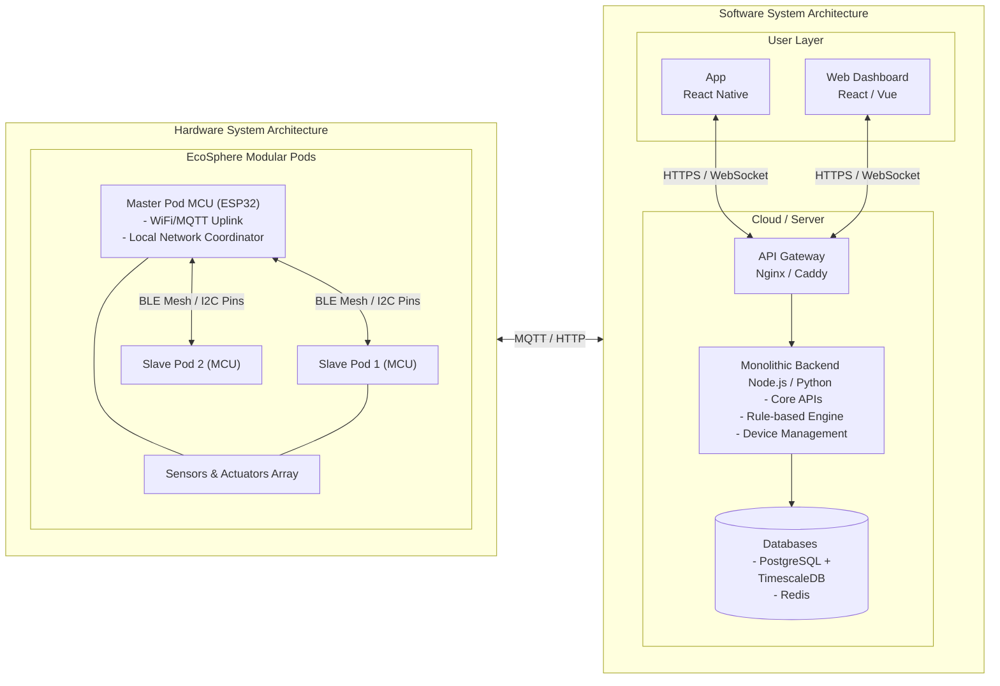

### 1.2 Key Technology Stack

| Layer | Module | Technology |
| --- | --- | --- |
| **Embedded** | Main MCU | ESP32 (Master) / STM32 or basic ESP32 (Slaves) |
| | Communication | WiFi (Master to Cloud) + BLE Mesh / Physical I2C (Inter-pod) |
| | Firmware | C / MicroPython |
| **Backend** | Framework | Node.js (Express) or Python (FastAPI) - Monolithic MVP |
| | Databases | PostgreSQL (with TimescaleDB extension) + Redis |
| | Message Queue | Redis Streams / Direct MQTT Integration |
| | Containerization | Docker (Docker Compose for single server deployment) |
| **Frontend** | App | React Native or Flutter |
| | Web | React / Vue + TypeScript |
| **Data / Analytics** | Framework | Python (Scikit-learn, Statsmodels) - Rule-based AI |
| | Storage | MinIO (S3-compatible) for Camera Image storage |
| | Processing | Python Pandas / CRON-based batch jobs |

## 2. Embedded System Technical Solution (EEE)

### 2.1 Hardware Architecture

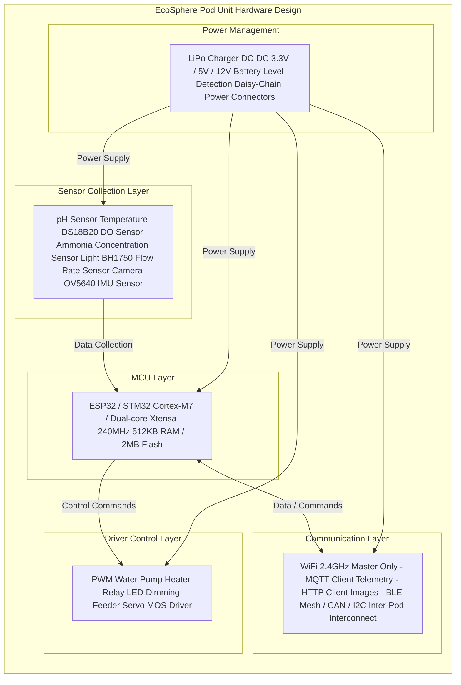

### 2.2 Communication Protocol Stack

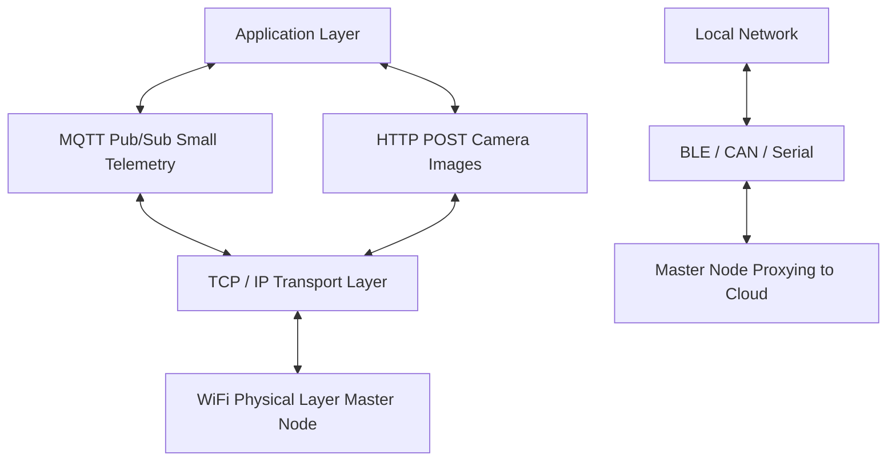

MQTT Topic Design:

```yaml
pod/{device_id}/sensor/{sensor_type}/data
  pod/{device_id}/sensor/ph/data                # pH Value
  pod/{device_id}/sensor/temperature/data       # Temperature
  pod/{device_id}/sensor/dissolved_oxygen/data  # DO
  
pod/{device_id}/actuator/{actuator_type}/cmd
  pod/{device_id}/actuator/pump/cmd             # Water Pump Control
  pod/{device_id}/actuator/heater/cmd           # Heater Control
  pod/{device_id}/actuator/feeder/cmd           # Feeder Control
  
pod/{device_id}/status/online                   # Online Status Heartbeat
pod/{device_id}/diagnostic/log                  # Diagnostic Log
pod/{device_id}/firmware/ota/check              # OTA Update Check
pod/{device_id}/config/update                   # Configuration Update
```

### 2.3 Embedded Firmware Architecture

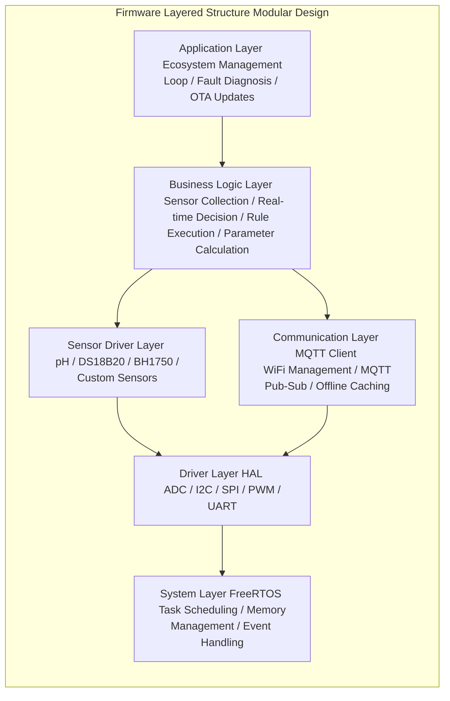

### 2.4 Real-Time Data Collection

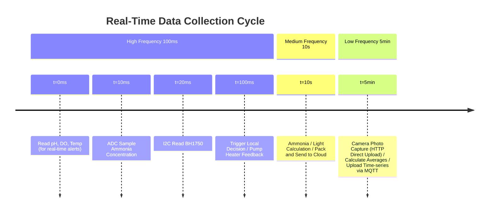

## 3. Backend Services Technical Solution (CS - Cloud Services)

### 3.1 Backend Service Architecture Overview

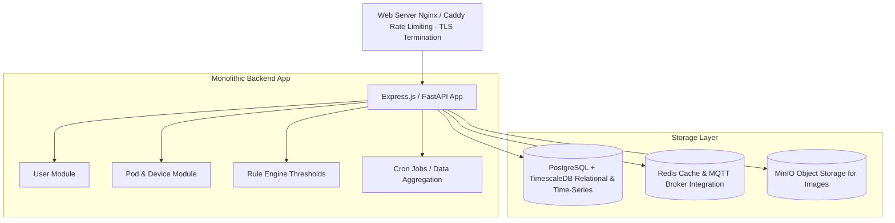

### 3.2 Database Design

#### PostgreSQL Relational Model (Key Tables)

```sql
-- Users Table
users:
  id (PK), email, password_hash, name, 
  avatar_url, phone, created_at, updated_at

-- Pod Pairing Table
pods:
  id (PK), device_id (unique), owner_id (FK), 
  pod_name, pod_type, status, 
  location, created_at, updated_at

-- Pod Configuration Table
pod_config:
  id (PK), pod_id (FK), 
  fish_species, plant_species,
  target_ph_min, target_ph_max,
  target_temp_min, target_temp_max,
  target_do_min, target_do_max,
  light_schedule, feeding_schedule,
  version, created_at

-- Alert Rules Table
alert_rules:
  id (PK), pod_id (FK), 
  sensor_type, condition (>, <, =, !=),
  threshold, severity (low/medium/high),
  enabled, created_at

-- Alert Log Table
alert_logs:
  id (PK), alert_rule_id (FK),
  pod_id (FK), triggered_value,
  message, status (new/acknowledged/resolved),
  created_at, resolved_at

-- Operation Log Table
operation_logs:
  id (PK), pod_id (FK), user_id (FK),
  action_type (manual_control, auto_adjustment, config_update),
  actor_type (system/user), details, created_at

-- User Subscription Table
subscriptions:
  id (PK), user_id (FK),
  tier (free/pro/enterprise),
  status (active/paused/cancelled),
  started_at, ended_at, auto_renew
```

#### TimescaleDB Hypertable (Time-Series Data)

```sql
-- Represents sensor telemetry over time using TimescaleDB
CREATE TABLE sensor_data (
    time        TIMESTAMPTZ       NOT NULL,
    pod_id      VARCHAR(50)       NOT NULL,
    sensor_type VARCHAR(20)       NOT NULL,
    value       DOUBLE PRECISION  NOT NULL,
    raw_value   INTEGER
);

-- Convert to Hypertable
SELECT create_hypertable('sensor_data', 'time');

-- Create Continuous Aggregates for Dashboards
CREATE MATERIALIZED VIEW sensor_hourly_aggs
WITH (timescaledb.continuous) AS
SELECT time_bucket('1 hour', time) AS bucket,
       pod_id, sensor_type,
       AVG(value) as avg_value,
       MAX(value) as max_value,
       MIN(value) as min_value
FROM sensor_data
GROUP BY bucket, pod_id, sensor_type;
```

### 3.3 API Interface Design

#### RESTful API Endpoints

```bash
# Authentication
POST   /api/auth/register        # Create Account
POST   /api/auth/login           # Login
POST   /api/auth/refresh         # Refresh Token
POST   /api/auth/logout          # Logout

# User Management
GET    /api/users/me             # Get Current User Info
PUT    /api/users/me             # Update User Info
GET    /api/users/subscription   # Get Subscription Info
PUT    /api/users/subscription   # Update Subscription

# Pod Management
GET    /api/pods                 # List All Pods
POST   /api/pods                 # Pair New Pod
GET    /api/pods/{pod_id}        # Get Pod Details
PUT    /api/pods/{pod_id}        # Update Pod Configuration
DELETE /api/pods/{pod_id}        # Delete Pod Pairing
GET    /api/pods/{pod_id}/status # Get Pod Real-time Status

# Sensor Data
GET    /api/pods/{pod_id}/sensor-data?start=T1&end=T2&type=ph
       # Query Sensor Data in Time Range
GET    /api/pods/{pod_id}/sensor-data/latest
       # Get Latest Sensor Data
GET    /api/pods/{pod_id}/sensor-data/statistics?period=1h
       # Get Data Statistics (average/max/min, etc)

# Actuator Control
POST   /api/pods/{pod_id}/actuators/pump/control
       # {"action": "on|off|pulse", "duration": 5000}
POST   /api/pods/{pod_id}/actuators/feeder/control
       # {"amount": 50, "unit": "grams"}
POST   /api/pods/{pod_id}/actuators/heater/control
       # {"target_temp": 26.5, "duration": 3600}
POST   /api/pods/{pod_id}/actuators/lighting/control
       # {"brightness": 80, "color_temp": 5000}

# Alerts and Notifications
GET    /api/pods/{pod_id}/alerts
       # Get All Alert Rules for Pod
POST   /api/pods/{pod_id}/alerts
       # Create New Alert Rule
PUT    /api/pods/{pod_id}/alerts/{rule_id}
       # Update Alert Rule
DELETE /api/pods/{pod_id}/alerts/{rule_id}
       # Delete Alert Rule
GET    /api/alerts/log?pod_id=&start=&end=&status=
       # Query Alert Log
PUT    /api/alerts/{alert_id}/acknowledge
       # Acknowledge Alert

# AI/Recommendations
GET    /api/pods/{pod_id}/eco-score
       # Get Ecosystem Score
GET    /api/pods/{pod_id}/recommendations
       # Get AI Optimization Suggestions
GET    /api/pods/{pod_id}/prediction?metric=plant_growth&days=7
       # Predict Future Trend

# Data Export
GET    /api/pods/{pod_id}/export?format=csv&start=&end=
       # Export Data as CSV/JSON
POST   /api/pods/{pod_id}/reports/generate
       # Generate Monthly Report

# WebSocket Real-time Push
ws://api.ecosphere.io/websocket?token=JWT_TOKEN
     # Connect and Subscribe to Pod Real-time Events
```

WebSocket Message Formats:

```json
// Subscribe Message Format:
{
  "type": "subscribe",
  "channels": ["pod:P001:sensor", "pod:P001:alerts"]
}

// Push Message Format:
{
  "channel": "pod:P001:sensor",
  "data": {
    "sensor_type": "temperature",
    "value": 26.5,
    "timestamp": "2026-04-07T10:30:00Z"
  }
}
```

#### MQTT Device-Server Communication

```yaml
# Device Publishes → Server Subscribes:
device_publish:
  - pods/{device_id}/sensor/+/data
  - pods/{device_id}/status/online
  - pods/{device_id}/diagnostic/log
  - pods/{device_id}/firmware/ota/ready

# Server Publishes → Device Subscribes:
server_publish:
  - pods/{device_id}/actuator/+/cmd
  - pods/{device_id}/config/update
  - pods/{device_id}/firmware/ota/start
  - pods/{device_id}/rule/execute
```

Message Formats:

```json
// Sensor Data
{
  "device_id": "ESP32_A1B2C3D4",
  "pod_id": "P001",
  "sensor_type": "temperature",
  "value": 26.5,
  "unit": "°C",
  "timestamp": "2026-04-07T10:30:15.123Z",
  "rssi": -65
}

// Actuator Command
{
  "device_id": "ESP32_A1B2C3D4",
  "command_id": "cmd_12345",
  "actuator_type": "pump",
  "action": "on",
  "duration_ms": 5000,
  "timestamp": "2026-04-07T10:30:00Z"
}

// Configuration Update
{
  "device_id": "ESP32_A1B2C3D4",
  "config_version": "2.0",
  "changes": {
    "target_ph": [6.8, 7.2],
    "target_temp": [25, 28],
    "sampling_interval_ms": 1000
  },
  "timestamp": "2026-04-07T10:30:00Z"
}
```

### 3.4 Real-Time Decision Making & Rule Engine

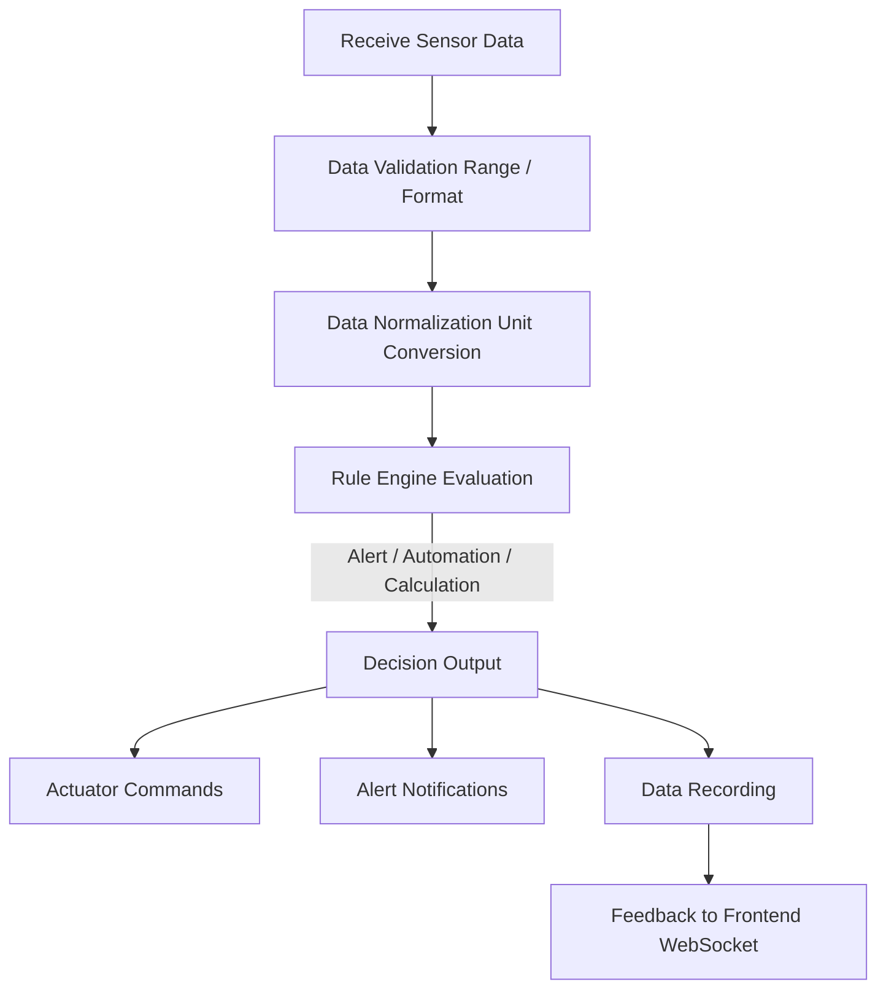

Example Rule Logic:

```yaml
# Alert Rule Example
IF:
  - (pH < 6.5 OR pH > 7.5)
  - AND pod_status = "active"
  - AND last_alert_not_in_last_1h
THEN:
  - Send Alert Notification to User
  - Record Alert Log
  - Trigger AI Inference for Recommendations

# Automation Rule Example (Based on Schedule)
IF:
  - time_of_day = "06:00"
  - AND pod_status = "active"
THEN:
  - Auto Feed (based on configuration)
  - Increase Lighting Brightness (sunrise effect)
```

## 4. Data & AI Technical Solution (Data / ML Engineering)

### 4.1 Simple Data & Analytics Pipeline

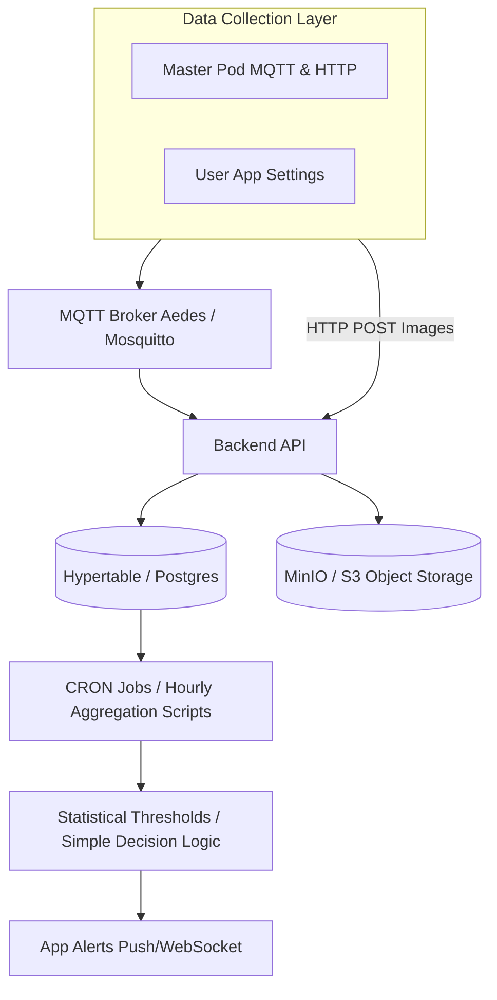

### 4.2 Data Analytics & Intelligence (MVP Phase)

Due to the "Cold Start" problem (lack of extensive labeled training data for a new hardware product), complex Deep Learning (DRL, CNNs) models are not feasible. The intelligence in MVP relies on Expert Systems and Statistical models.

#### 4.2.1 Core Analytics & Rules

Rule 1: Ecosystem Imbalance Warning (Threshold & Trend):

```yaml
Input: [pH, DO, Temp, Ammonia] (Hourly moving average)
Logic: 
  - Static Threshold: Trigger warning if Ammonia > 1.0 ppm
  - Time-series Trend (Linear Regression): "pH has risen consistently by 0.1/day for 3 days"
Output: "Alert: Ammonia spike detected. Suggest reducing feeding."
```

Rule 2: Automated Interventions:

```yaml
Logic:
  - If Temp < Target_Min => "Turn Heater ON" via MQTT
  - If DO < Target_Min => "Turn Pump HIGH"
  - If Plant_Growth Light Hours < Required => "Turn LED ON at 6 PM"
```

#### 4.2.2 Simple Anomaly Detection (Statistical)

```yaml
Algorithms:
  - Z-score or Moving Average deviation
Goal: Detect obvious hardware/sensor failures (e.g., pH dropping from 7 to 0 instantly).
Threshold: Exceeding 3 sigma from the 24-hour mean triggers a calibration check.
```

### 4.3 Machine Learning Pipeline (Deferred to Post-Launch)

True ML models (like predicting fish stress via CV, or forecasting complex system crashes) will only be trained *after* collecting sufficient real-world data across hundreds of active units into a data warehouse. Until then, basic cron jobs executing Python statistical scripts (using Pandas or Statsmodels) are scheduled on the main Monolith Server.

## 5. System Integration & Interface Specification

### 5.1 Embedded Device & Cloud Service Integration

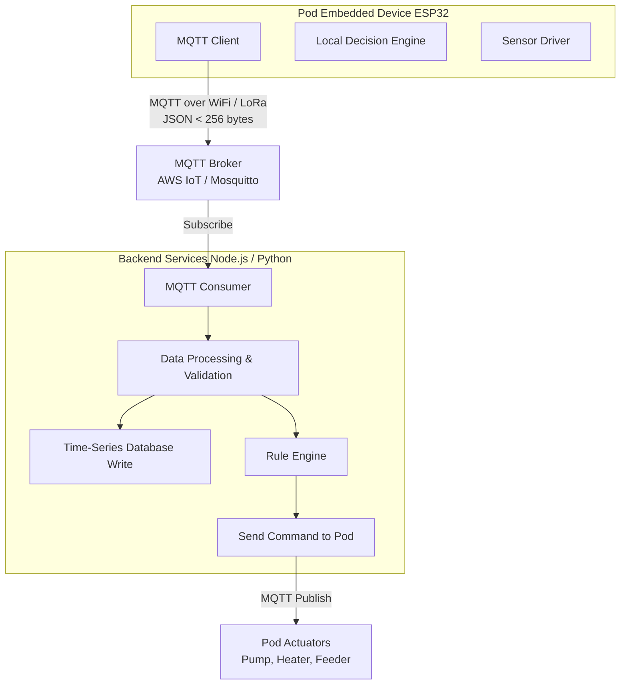

Key Integration Points:

```yaml
Device Authentication:
  - Certificate Authentication (X.509) or Key Pair
  - Each Pod has unique device_id
  - Secure MQTT Connection (TLS 1.2+)

Reliability Guarantees:
  - MQTT QoS 1 (at least once delivery)
  - Message ID Tracking
  - Timeout Retry Mechanism
  - Offline Cache and Synchronization

Performance Optimization:
  - Compress JSON (msgpack or protobuf)
  - Batch multiple data points
  - Adapt to Network Packet Loss (retry strategy)
```

Message Format Standardization:

```json
// Device Publish
{
  "msg_type": "sensor_data",
  "device_id": "D123456789",
  "data": {
    "ph": 7.2,
    "temp": 26.5,
    "do": 8.1,
    "timestamp": 1712500000000
  }
}

// Server Response
{
  "msg_id": "ACK_123",
  "status": "success",
  "timestamp": 1712500001000
}
```

### 5.2 Web / App Frontend & Backend Integration

```mermaid
flowchart TD
    Client[Web Dashboard React <br> + Mobile App React Native]
    
    Client -- "REST API (HTTP)" --> REST["/api/pods, /api/sensors, /api/control, /api/alerts/"]
    Client -- "WebSocket (Bi-directional)" --> WS[Real-time Data Push <br> Temperature Real-time Changes, etc]
    
    REST & WS --> GW[API Gateway Express.js <br> Authentication JWT/Rate Limiting/CORS]
    
    GW --> Logic[Business Logic Layer <br> User Management/Pod Management/Data Query/Decision Engine]
    
    Logic --> DB[(Primary Database PostgreSQL)]
    Logic --> TSDB[(Time-Series Database InfluxDB)]
    Logic --> Cache[(Cache Layer Redis)]
```

Frontend-Backend Interaction Example:

```javascript
// 1. Frontend Initialization
fetch('/api/auth/verify', {
  headers: {'Authorization': 'Bearer JWT_TOKEN'}
})

// 2. Get Pod List
// GET /api/pods
Response: [
  {
    id: "P001",
    name: "Living Room Ecosystem Wall",
    status: "online",
    last_seen: "2026-04-07T10:30:00Z"
  }
]

// 3. Get Latest Sensor Data
// GET /api/pods/P001/sensor-data/latest
Response: {
  temperature: 26.5,
  ph: 7.2,
  do: 8.1,
  timestamp: "2026-04-07T10:30:15Z"
}

// 4. Establish WebSocket Connection for Real-time Data
ws = new WebSocket('wss://api.ecosphere.io/ws?token=JWT')
ws.send({
  type: 'subscribe',
  pod_id: 'P001',
  channels: ['sensor_data', 'alerts']
})

// 5. Receive Real-time Updates
ws.onmessage = (event) => {
  data = JSON.parse(event.data)
  if (data.channel === 'sensor_data') {
    updateTemperatureChart(data.value)
  }
}

// 6. User Manual Control of Actuator
// POST /api/pods/P001/actuators/pump/control
Request: {
  action: 'on',
  duration_ms: 5000
}
Response: {
  command_id: 'CMD_12345',
  status: 'sent_to_device',
  expected_ack_time: 500
}
```

### 5.3 Multi-Pod Modular Integration

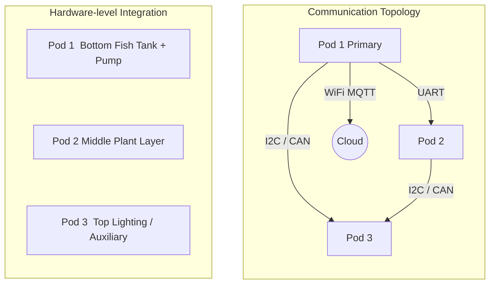

Data Aggregation & Control Logic:

```yaml
# Data Aggregation (Cloud)
process:
  - Three Pods send independent sensor data
  - Cloud binds as one "Ecosystem"
  - Generate unified ecosystem score

# Coordinated Control (Cloud to Device)
rule:
  condition: IF Pod1_DO < 6
  actions:
    - Pod1: Turn on main pump for 30s
    - Pod2: Turn on auxiliary pump for 15s
    - sync: Maintain water circulation balance

# Database Table Design
ecosystem_table:
  fields: [id, user_id, name, pod_ids, total_volume, created_at]

ecosystem_rules_table:
  fields: [id, ecosystem_id, pod_combination, condition, action, priority]
```

## 6. Data Security & Privacy

### 6.1 Data Protection Strategy

```yaml
Transport Layer Security:
  - HTTPS (TLS 1.2+) for REST API
  - TLS 1.2+ for MQTT
  - Certificate Pinning

Storage Layer Security:
  - Database Encryption (Transparent Data Encryption)
  - Sensitive Field Encryption: [API Key, User Password]
  - Regular Backups to Offline Storage

Authentication:
  - JWT (JSON Web Tokens) for API
  - 2FA Support (TOTP)
  - OAuth 2.0 for Third-party Integration

Authorization & Access Control:
  - Role-Based Access Control (RBAC):
      - User: View own Pod
      - Admin: System Administration
      - Analyst: Data Analysis
  - Resource-Based Access:
      - User A cannot see User B's Pod data

Audit Logging:
  - All API calls recorded
  - Data modification history
  - Abnormal login alerts
  - GDPR compliance auditing

Data Deletion & Privacy:
  - Users can request data export
  - Users can request account deletion
  - Delete sensitive data after 30 days
  - Clear all data after 30 days of deletion
```

### 6.2 API Security Design

```yaml
Rate Limiting:
  authenticated_users: 100 requests/minute
  unauthenticated: 10 requests/minute
  data_export: 5 requests/hour

Input Validation:
  - JSON Schema Validation
  - SQL Injection Prevention (Parameterized Queries)
  - XSS Prevention (Content Escaping)

Error Handling:
  - Generic Error Messages (No Internal Details Leakage)
  - Detailed Logging (Internal Record)
  - Exception Alerts (Security Team Notification)
```

## 7. Performance Metrics & Observability

### 7.1 Key Performance Indicators (KPIs)

```yaml
System Performance:
  - API Response Time: < 200ms (99th percentile)
  - Database Query: < 100ms (95th percentile)
  - WebSocket Push Latency: < 100ms
  - Pod Device Connection Time: < 5s

Reliability:
  - System Uptime: > 99.5%
  - Pod Connection Rate: > 95% (active online)
  - Data Delivery Success Rate: > 99%
  - Alert Accuracy Rate: > 90%

Model Performance:
  - Prediction Accuracy: > 85%
  - Task-Specific F1 Score: > 0.8
  - Cloud Inference Latency: < 500ms
  - Edge Inference Latency: < 200ms

User Experience:
  - App Startup Time: < 3s
  - Page Load Time: < 1s
  - Day-7 User Retention Rate: > 40%
  - App Crash Rate: < 0.1%
```

### 7.2 Monitoring & Alerting

```yaml
Monitoring Time-Series Data:
  Application Metrics:
    - Request Rate, Error Rate, Latency (Histogram)
    - Active Users, Pod Count
    - Model Inference Call Frequency
  
  Infrastructure Metrics:
    - CPU, Memory, Disk Usage
    - Network Bandwidth, Connection Count
    - Docker Container Status
  
  Business Metrics:
    - Subscription Activation Count
    - Alert Trigger Frequency
    - Pod Active Usage Rate

Monitoring Tech Stack:
  - Prometheus: Metric Collection
  - Grafana: Visualization Dashboard
  - ELK Stack: Log Aggregation (Elasticsearch, Logstash, Kibana)
  - Jaeger: Distributed Tracing
  - PagerDuty: Alert Escalation

Key Alert Rules:
  - Backend Service Down: Alert Immediately
  - Error Rate > 5%: Alert Within 30 Minutes
  - Pod Connection Failure > 20%: Notify User Within 15 Minutes
  - Database Slow Query > 1000ms: Investigate Logs
  - Model Accuracy Drop > 10%: Trigger Retraining
```

## 8. Reference Architecture & Best Practices

| Layer | Recommended | Alternative |
| --- | --- | --- |
| **Embedded MCU (Master)** | ESP32 | STM32H7 + ESP8266 |
| **Embedded MCU (Slave)** | ESP32-C3 / RP2040 | Standard STM32 |
| **Embedded OS** | FreeRTOS | Zephyr OS |
| **Programming Language** | C / MicroPython | Rust |
| **MQTT Broker** | Mosquitto (Self-hosted) | AWS IoT Core / EMQX |
| **Backend Framework** | Node.js (Express) | Python (FastAPI) |
| **Database & Time-Series** | PostgreSQL + TimescaleDB | MySQL 8.0 |
| **Cache & Task Queue** | Redis | RabbitMQ (if needed later) |
| **Frontend Framework** | React Native (App) | Flutter |
| **AI / Analytics Framework** | Scikit-learn / Pandas | Core Python Logic |
| **Deployment** | Docker Compose (Monolith) | Managed PaaS (Render / Heroku) |
| **Log Collection** | Self-hosted PM2 / Simple File | Datadog (when revenue allows) |
